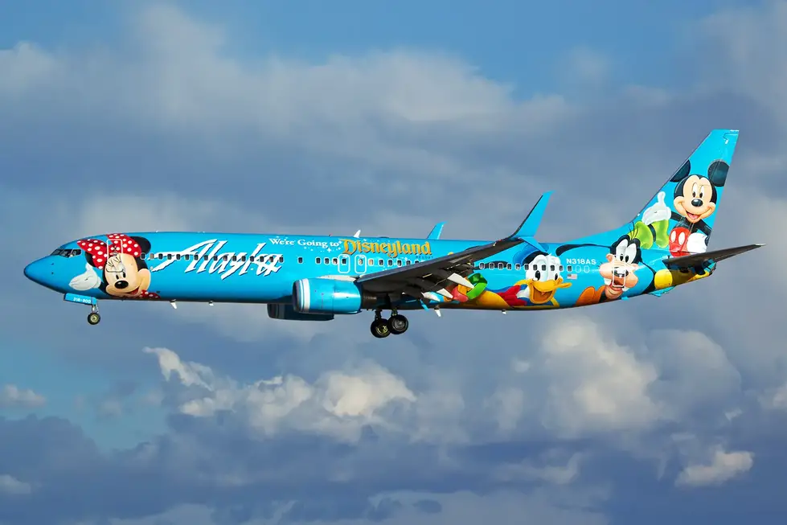
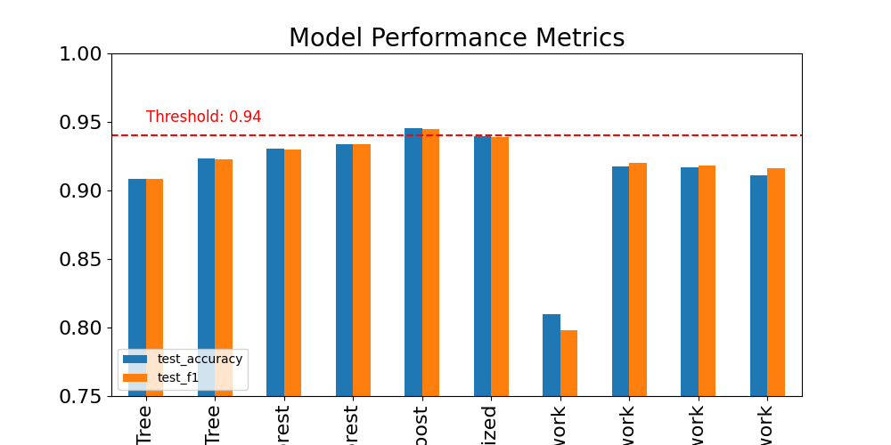
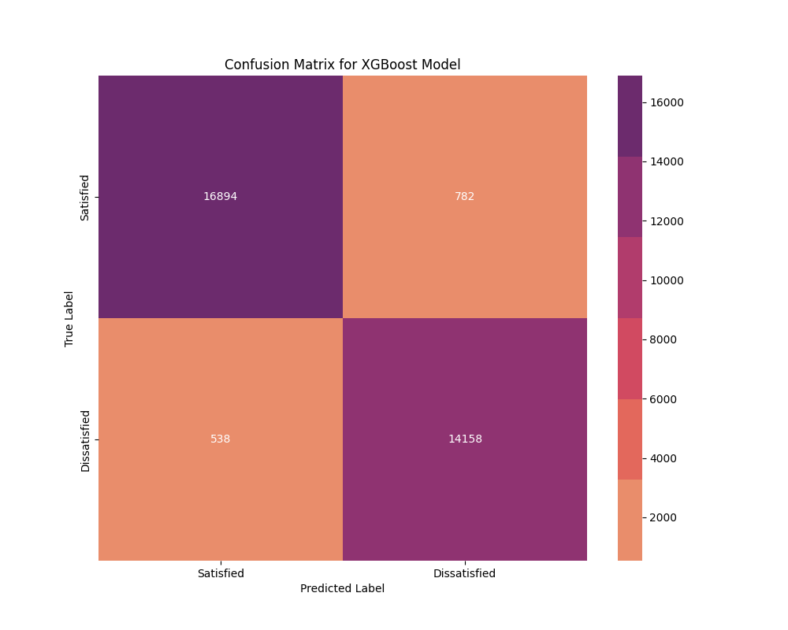
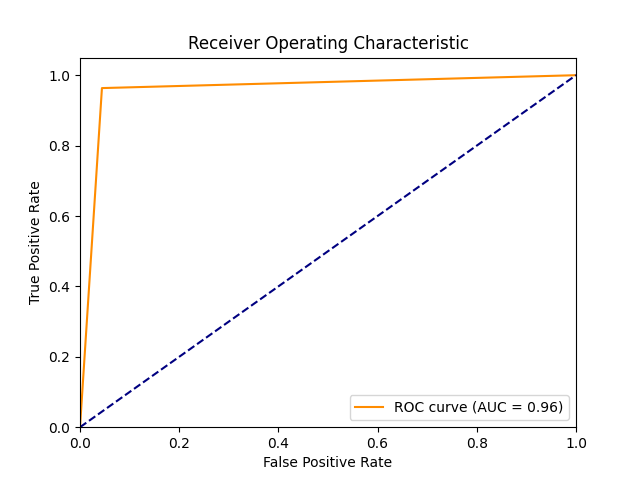
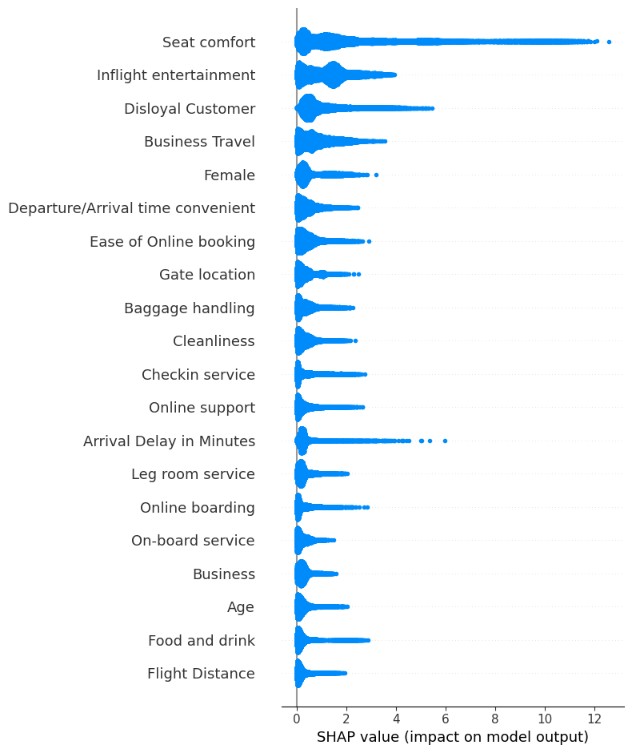

# Disney Airline: Feature Exploration Using Classification Modeling

Author: Emily Marsh

## Introduction
In 2019 JustDisney.co, a [Walt Disney fan site]('https://airlinegeeks.com/2019/07/23/what-if-the-disney-airline-rumor-was-true/'), released a false rumor about a Disney airline. While Disney at the time confirmed the story was false, the viral moment showed that there was considerable consumer interest in this venture. It is also becoming more clear that the airline industry is ripe for a new player in the field. 2023 is the first year since 2020, and the beginning of the COVID pandemic, [according to IATA]('https://www.iata.org/en/pressroom/2022-releases/2022-12-06-01/'), that airlines will have a net profit position. This net profitability totaled USD 9.8 billion. Now that the industry has stabilized due to lower fuel costs and increased travel, the potential profits are an enticing invitation for new companies such as Disney to expand into this promising market.

## Business Objective

The Disney Company is interested in entering the airline industry as a way to create a new profitable enterprise and as a natural addition to streamlining the Disney resort and cruise experience that already has a loyal customer base. However, before investing capital in this new venture, Disney has commissioned this project team to analyze and build a classification model to determine which airline features result in the least amount of dissatisfied customers. As a company that inspires strong brand loyalty in its customers, making sure that there is a positive experience in all of its markets is of extreme importance. However, consideration will also be given to the cost to implement the recommended airline features to balance profit with customer experience. Using the dataset and outside research this project will provide insight into the top three airline features with the biggest impact reducing the number of dissatisfied customers.

## Dataset

The dataset used for this project is a dataset from **Kaggle** and consists of **129,880 rows** and **23 columns**. This data was collected by an airline organization. The actual name of the company is not given due to privacy. The dataset consists of the details of customers who have already flown with this airline company. The feedback of the customers on various features of their flight and their flight data has been consolidated. The columns of the dataset include the features **Satisfaction, Gender, Customer Type, Age, Type of Travel, Class, Flight Distance, Seat Comfort, Departure/Arrival Time Convenience, Food & Drink, Gate Location, Inflight Wifi Service, Inflight Entertainment, Online Support, Ease of Online Booking, On-Board Service, Leg Room Service, Baggage Handling, Checkin Service, Cleanliness, Online Boarding, Departure Delay in Minutes, and Arrival Delay in Minutes**. Individuals have two values for satisfaction:

* **Satisfied**
* **Dissatisfied**

Since the model will be used for identifying feature importance as well as predicting the satisfaction of the customer, **F1 Score** will be used to assess the accuracy of the models developed using the dataset. The reason for using an **F1 score** versus any other metrics of accuracy is that eliminating false negatives and false positives will ensure the accuracy of the feature recommendations. This model will be designed to be proactive as well as reactive, therefore eliminating false positives and negatives will be the goal.

## Methods

The dataset size is large and the computational power needed to build a more complex model such as a Neural Network is high. Therefore, a smaller subset of the dataset was created for model building and fitting. In order to determine which classification model was appropriate for prediction and feature recommendation, six models were built. Once built and fitted, the classification model with the highest F1 score on unseen test data was selected to be fine-tuned and utilized to make feature recommendations for the client. The F1 score was selected as the accuracy metric because it is the metric that takes into account false positives and false negatives. This is important since the client wants to minimize incorrect predictions and maximize the accuracy of the features recommended by the final model. 

## Visualizing Model Performance

Compared to the F1 Score of previous models, the XGBoost Model vastly improved the accuracy of the predictions on unseen test data. XGBoost models are excellent for classification problems due to their ability to handle complex interactions between features and their regularization techniques, which help prevent overfitting. They leverage an ensemble of Decision Trees, boosting their predictive power and providing highly accurate and robust classifications for a wide range of tasks. Using this model allowed for more consistent AUC and F1 scores across the test and train datasets. Based on this evaluation, the XGBoost model is the final model that will be used for prediction and feature recommendation. 

* **The F1 Score associated with the XGBoost Model was 0.945**
* **The F1 Score Associated with the Optimized XGBoost Model was 0.94**
* **The F1 Score Associated with the Optimized Random Forest was 0.933**

# Final Model Visualizations

Since the XGboost Model was confirmed to be the most successful according to the F1 score metric, the model was run with the entire dataset. The resulting **F1 score was lifted to a 0.96 performance on unseen data**. The high performance of the model on unseen data was confirmed in both a classification matrix visualization as well as a ROC Curve visualization. 

## Conclusions

Disney has a final classification model for prediction with an **F1 Score of 96% performance on unseen test data and an AUC score of 96% performance on unseen test data**. The model was used to make predictions on whether an airline customer would be **Satisfied or Dissatisfied** with their airline experience in order to make feature recommendations to decrease the number of dissatisfied customers.

The three features, as determined by the final model were:

* **Seat Comfort**
* **Inflight Entertainment**
* **Disloyal Customers**

## Recommendations

Now that a model has been built and trained that can predict with reasonable accuracy features that had the greatest impact on airline customer satisfaction, it can be used to recommend the top features that Disney should implement in their Disney airline venture. **It is recommended that Disney Airlines should prioritize the following features and be prepared to expect the following financial costs**:

* **Seat Comfort with a Potential Cost of 1.38 million USD per Plane**
* **Inflight Entertainment with a Potential Monthly Savings of 175,000 USD per Month**
* **Disney Airline Loyalty Program with a Potential Profit of 400 Million USD per Year**

Of the three feature recommendations, only one would need to be implemented with a financial loss.

## Next Steps

To continue towards the goal of prioritizing feature recommendations that will lead to the least amount of dissatisfied customers, Disney could follow these additional suggestions:

* **Additional Domain Research for More Accurate Feature Costs and Profit Numbers**
* **Conduct Additional Research into other features identified as being important by the SHAP values**
* **Additional exploration into the optimized parameters for the LSTM and XGBoost Models to increase F1 scores**
* **Expand Dataset to better represent the potential customer base for a Disney Branded Airline**

## References

* [What If the Disney Airline Rumor Was True](https://airlinegeeks.com/2019/07/23/what-if-the-disney-airline-rumor-was-true/)
* [Airlines Cut Losses in 2022; Return to Profit in 2023](https://www.iata.org/en/pressroom/2022-releases/2022-12-06-01/)
* [Main Parameters in XGBoost](https://medium.com/@rithpansanga/the-main-parameters-in-xgboost-and-their-effects-on-model-performance-4f9833cac7c)
* [Binary Classification Tutorial with the Keras Deep Learning Library](https://machinelearningmastery.com/binary-classification-tutorial-with-the-keras-deep-learning-library/)
* [XGBoost Feature Importance Computed in Three Ways with Python](https://machinelearningmastery.com/binary-classification-tutorial-with-the-keras-deep-learning-library/)
* [Explaining Machine Learning Models](https://www.aidancooper.co.uk/a-non-technical-guide-to-interpreting-shap-analyses/)
* [How Much Do Aircraft Seats Cost?](https://simpleflying.com/aircraft-seats-cost-guide/)
* [How Much Does A Movie License Cost An Airline](https://valourconsultancy.com/much-movie-license-cost-airline/#:~:text=In%202017%2C%20we%20estimated%20the,multiple%20movies%20within%20an%20order)
* [How Much Does A Loyalty Program Cost In 2023](https://www.stampme.com/blog/how-much-does-a-loyalty-program-cost)
* [SeatGuru Seat Map United](https://www.seatguru.com/airlines/United_Airlines/United_Airlines_Airbus_A320_V3.php)

## For More Information

The full analysis and process by which these conclusions were reached can be found in the [Jupyter Notebook](Notebook.ipynb) or by reviewing the summary presentation.

For additional questions, contact Emily Marsh: marshemily2@gmail.com

## Repository Structure
